# Zero Waste Kitchen 

<!--  -->

Welcome to the **Zero Waste Kitchen** project repository! This is a Flutter-based mobile application that aims to reduce kitchen food waste by allowing users to share excess food items with NGOs, INGOs, orphanages, and old age homes. The application is built using Flutter for the frontend and Firebase for the backend. 

## Table of Contents

- [About](#about)
- [Features](#features)
- [Getting Started](#getting-started)
  - [Prerequisites](#prerequisites)
  - [Installation](#installation)
- [Firebase Configuration](#add-firebase-configuration)  
- [License](#license)
- [Contributing](#contribution)
- [Screenshots](#screenshots)


## About

The **Zero Waste Kitchen** project was inspired by the idea of promoting sustainability and social responsibility by addressing the issue of food wastage. This mobile app provides a platform for users to share excess food items from their kitchens with those in need, such as NGOs, INGOs, orphanages, and old age homes.

## Features

- User authentication and registration
- Browse and post available food items
- Search and filter food listings
- Direct messaging between users and organizations
- Notifications for new food listings and messages
- User profiles and preferences
- Admin dashboard to manage organizations and listings

## Getting Started

Follow these instructions to get the project up and running on your local machine.

### Prerequisites

- Flutter SDK (Follow the [official installation guide](https://flutter.dev/docs/get-started/install))
- Firebase account (Create a project on the [Firebase Console](https://console.firebase.google.com/))

### Installation

1. Clone the repository:

```bash
git clone https://github.com/ShishirRijal/zero-waste-kitchen.git
```
2. Navigate to the project directory:

```bash
cd zero-waste-kitchen
```
3. Open the project in your favourite IDE
4. Get flutter dependencies
```bash
flutter pub get
```
5. Add firebase configuration

The project utilizes Firebase services for authentication, real-time database, and cloud messaging. To configure Firebase, follow these steps:
<ul>
  <li>Create a Firebase project at the Firebase Console.</li>
<li>Generate and download the google-services.json file for Android and GoogleService-Info.plist file for iOS.</li>
<li>  Place these files in the respective platform directories: </li>  
  <ul>
    <li>For Android: android/app/google-services.json </li>
    <li>For iOS: ios/Runner/GoogleService-Info.plist </li>
  </ul>
<b>For more details on Firebase configuration, refer to the official FlutterFire documentation. </b>
</ul>

## License
This project is licensed under the Apache License 2.0

## Contribution
Contributions are welcomed! You can start contributing to the Zero Waste Kitchen project right now.

## Screenshots

### Sign Up | Create new account
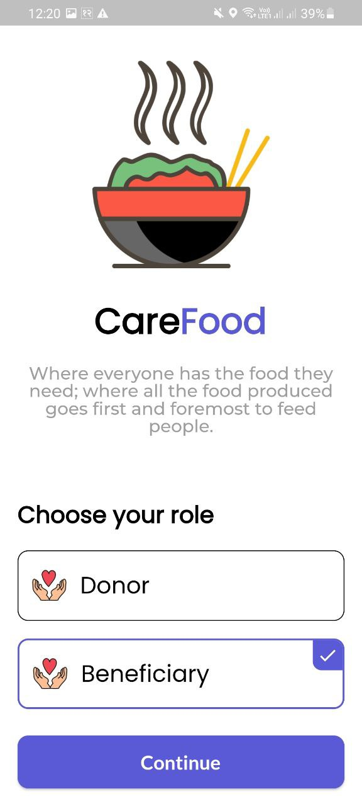 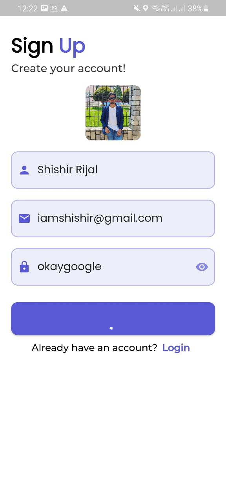 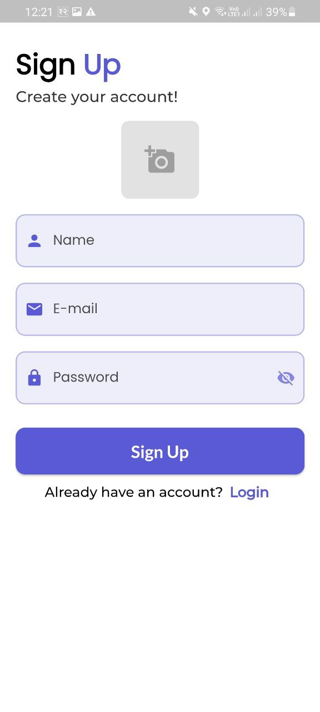 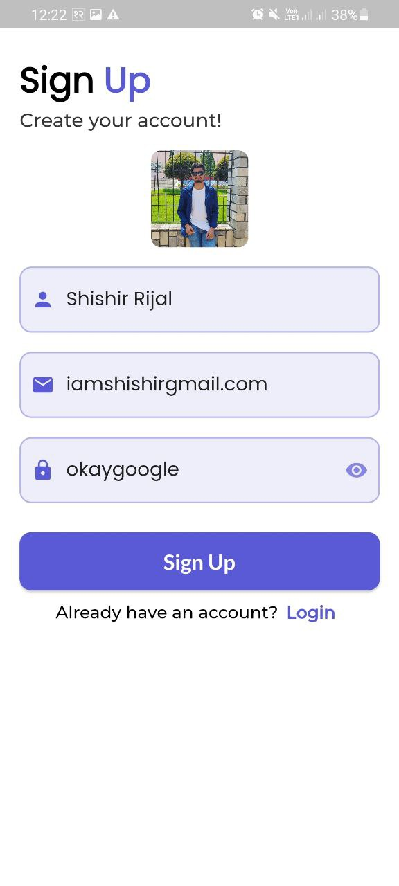 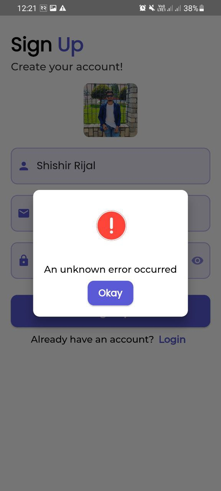 


### Login 
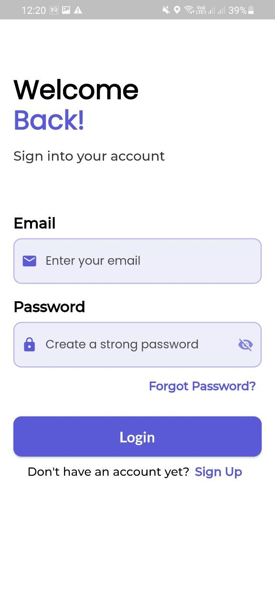

 ### Home | Donations | Donation Detail Overview
 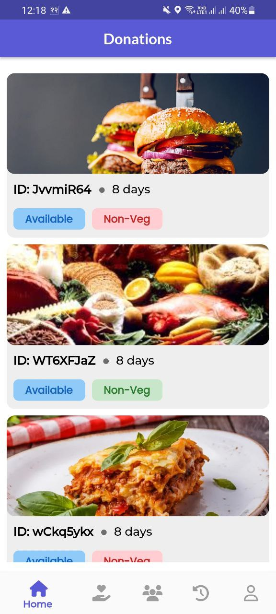 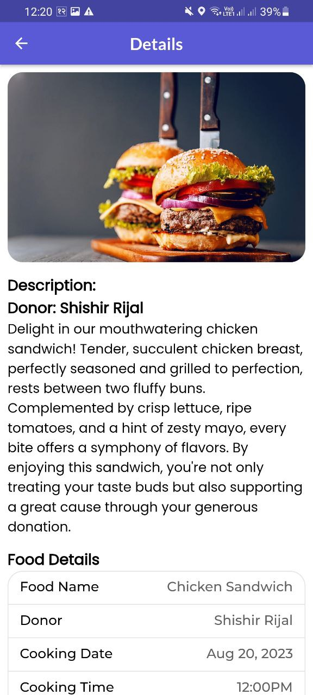 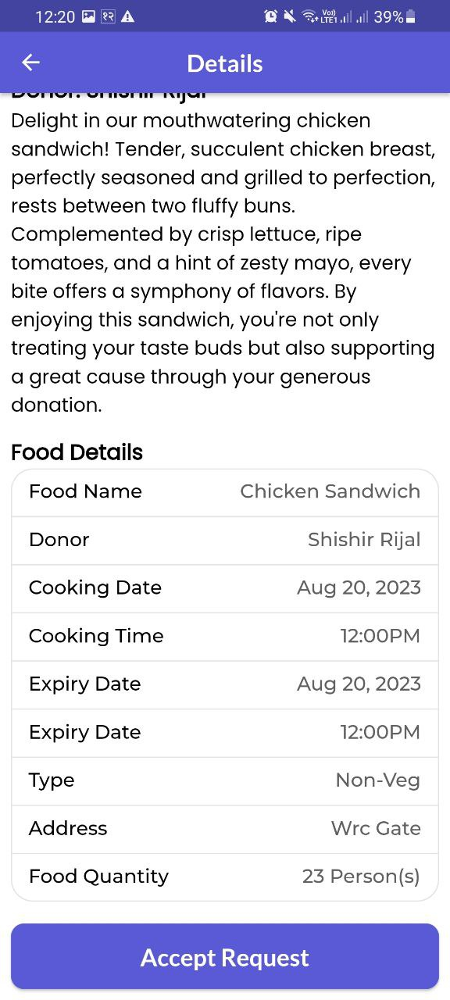 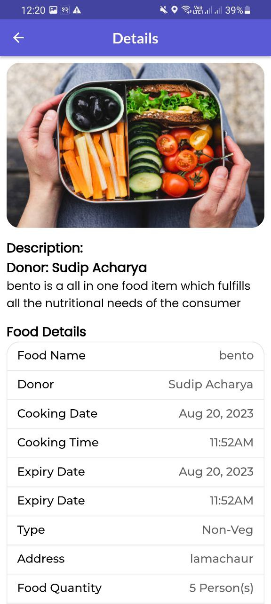  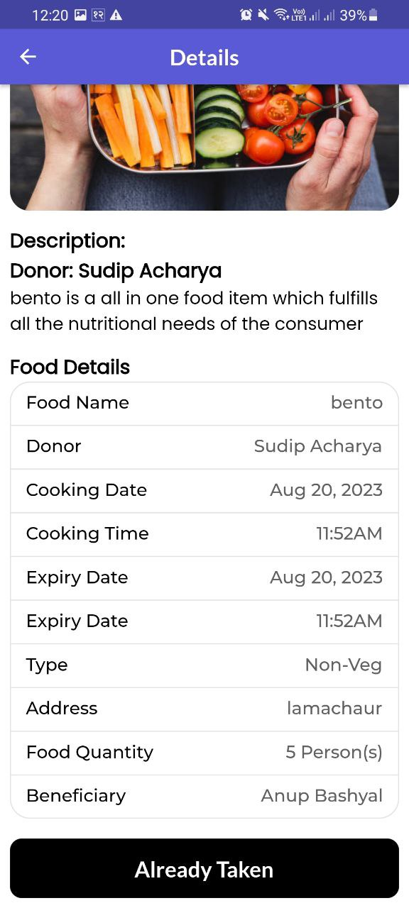 

 ### Create Donation
 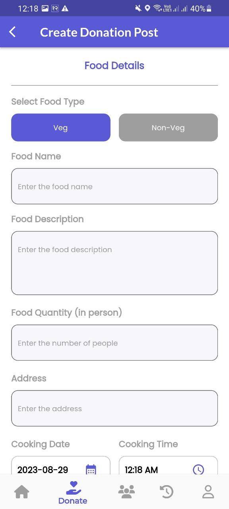 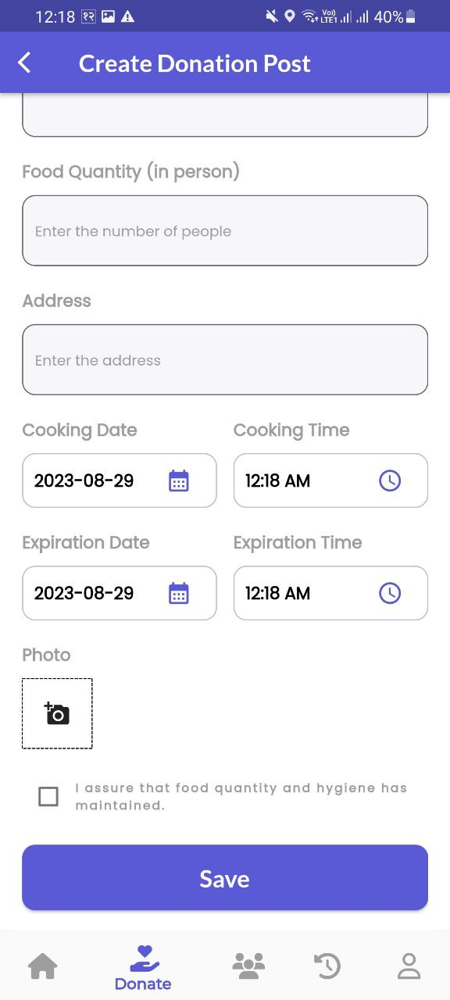

### Donors And Beneficiaries
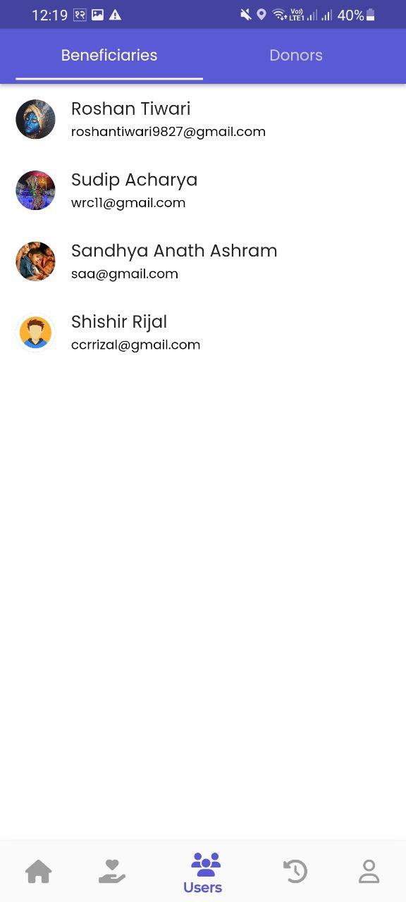 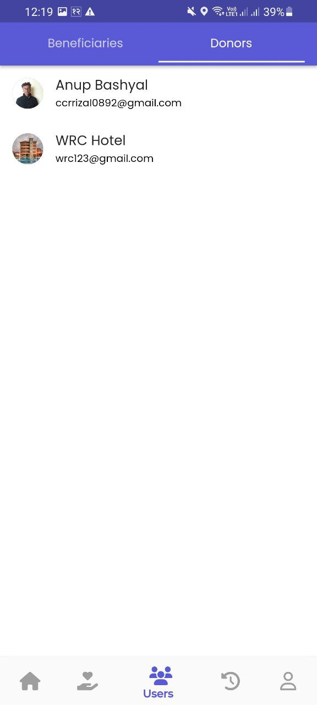

### Donation History 
 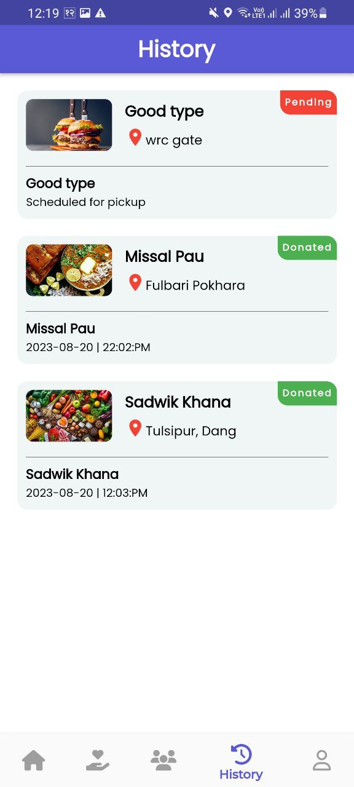

### Donor/Beneficiary Profile
  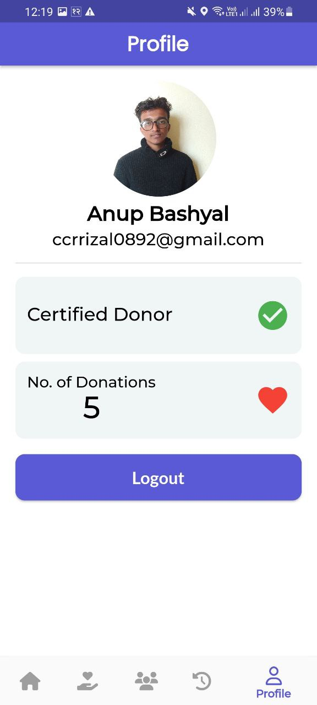
 
